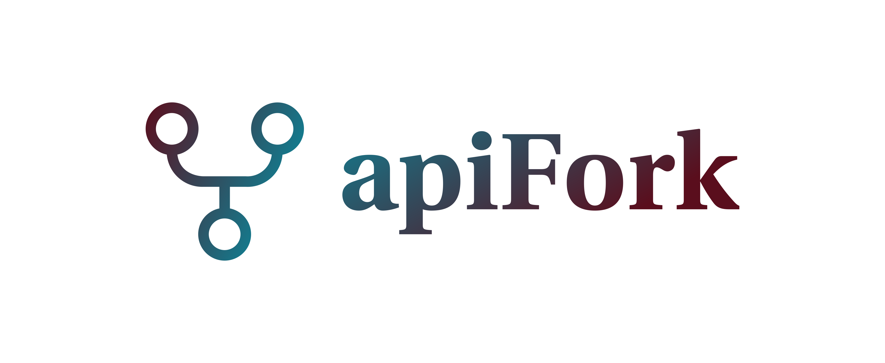
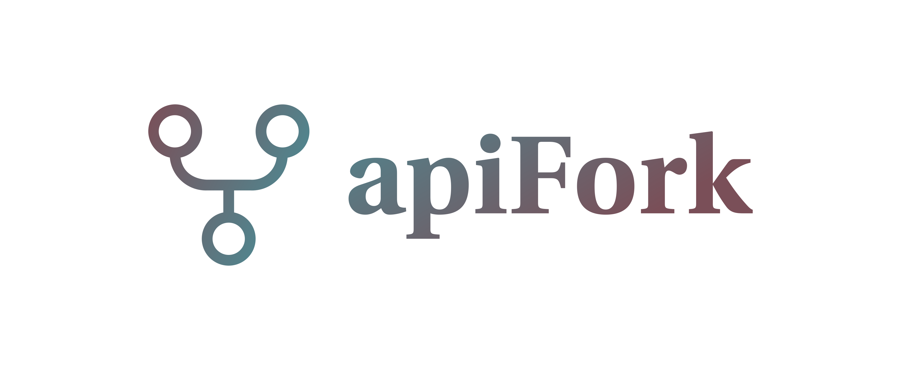

# logo.apifork.com

        Font in use <a target="_blank" href="https://github.com/StefanPeev/Linguistics-Pro">LinguisticsPro-Bold</a> designed by
        <a target="_blank" href="https://localfonts.eu/">Local Fonts</a>
        and licensed under
        <a target="_blank" href="http://scripts.sil.org/cms/scripts/page.php?site_id=nrsi&amp;id=OFL_web">Open Font License.</a>
          Icon Designed by
          <a target="_blank" href="https://thenounproject.com/rahmanhp">Rahman Haryanto</a>
          
          
          

## Font

    #147A8D, #5A0E1D
    #52848D, #7A4F58

## Background
    
    transparent

## Icon

    #5A0E1D, #147A8D
    #7A4F58, #52848D

## 1

## 2

## 3

## 4

---

+ [edit](https://github.com/apifork/logo/edit/main/README.md)
+ [apifork/logo/](https://github.com/apifork/logo/)

          
